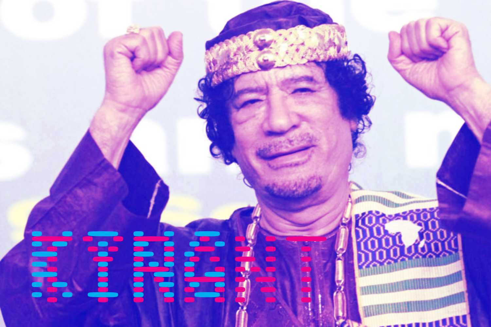

# King or Tyrant

Both are systems[^1] whose energy[^2] is provided[^3] by other systems[^4]. Kings invests use surplus for greater good, Tyrant use to inflate their egos[^5].

[^1]: Traditionally the elite was composed of the clergy whose role was to maintain social cohesion, a doctor to maintain the physical health or a lawyer to help resolve conflicts of the community who supports these nonessential to life tasks.

[^2]: (food, shelter)

[^3]: Generally for the benefit of the greater good, unless the elite perceive themselves as the originator of the wealth entrusted to them instead of the recipient of the commonwealth surplus. Breaking this trust increase greatly the chances of revolution and civil war.

[^4]: Imagine a tribe with just enough to eat when everyone works. They are in perfect energy equilibrium. As there is more food made available than is required, a surplus can be extracted. At first we decide to have a chief who will help coordinate everyone. As efficiency rises there is less and less people cultivating land and more and more external energy required to maintain our food supply. 

[^5]: The King respect the surplus, the Tyrant demands it.
